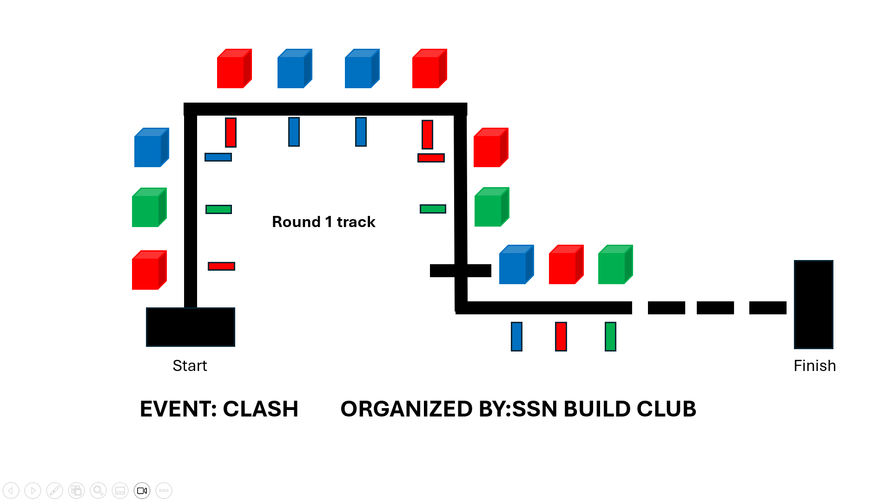
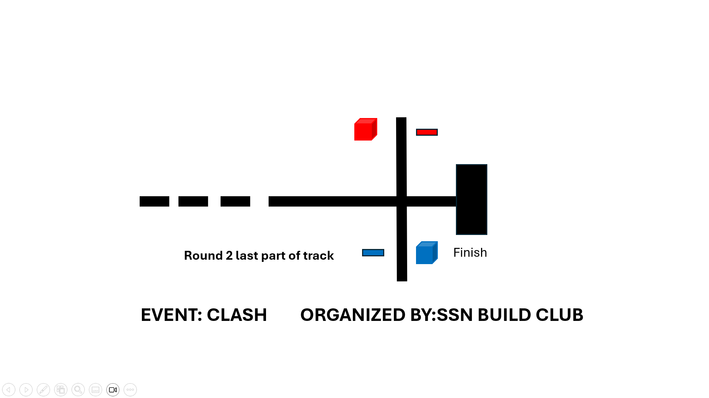

# CLASH: Color Line-following & Autonmous Stacking Hunt

 

## Event Introduction

Welcome to an exciting robotics challenge themed around rescue operations. Participants will design and program autonomous robots—Rescue Bots—that navigate, detect, and manipulate colored objects to simulate a real-life rescue mission. Success in this challenge requires a perfect blend of robust hardware, intelligent software, and strategic decision-making.

### Core Capabilities

The core functionality for these bots revolves around two key capabilities:

* **Line Following & Color Detection:**
    Robots must follow a predefined line path while detecting colored cubes (red, green, blue) positioned alongside the track. They must accurately count the cubes, interpret track intersections, and make intelligent decisions based on the data they gather.

* **Pick and Place Operations:**
    Based on color detection and counts, the robot will engage in precise pick-and-place tasks, sorting and moving cubes to designated zones.

---

## Competition Structure

### Phase 1: Qualifier - Basic Navigation & Counting

In this stage, the bot will perform fundamental navigation and sorting tasks on a pre-disclosed map. A rough demo map for phase 1 is given below:

 

#### Objectives:

1.  **Navigation:** The robot will navigate a black track. Colored cubes (**5x5x5 cm**) will be placed on the **left side** of the line_following track.
2.  **Counting:** As the robot moves, it must maintain a running count of the cubes for each color (Red, Green, Blue).
3.  **Checkpoint Logic:** The track includes **intersections** marked by a fully black strip (equal in width to the track). Upon reaching an intersection, the bot must analyze its current cube count to determine which color has appeared most frequently so far.There will be one box of each color placed after the intersection. After analysis, the bot must proceed and pick up the respective box.
4.  **Placement Task:**  After picking, the bot continues along the line.There will be broken lines at the end, once the bot detects the broken lines, it should continously check for all black region(FINISH region).The bot should stop once it detects the FINISH region and it has to place the box on the ground.

---

### Phase 2: The Final - 24hr Rescue Hackathon

This stage is an on-the-spot hackathon on a new, un-disclosed map, designed to simulate a complex real-world rescue operation.

 

#### The Mission:

As the robot navigates the path, it must identify and count all colored cubes. The cubes represent different entities:
* 🟥 **Red Cubes:** Bomb Hazard – **Must be collected.**
* 🟦 **Blue Cubes:** Radioactive Material – **Must be collected.**
* 🟩 **Green Cubes:** Safe Civilians – **Must NOT be collected or disturbed.**

#### Phases of Operation:

1.  **Scanning Run:** The robot must first navigate the entire assigned path to identify and count all colored cubes.
2.  **Collection & Delivery Run:** After the initial scan, the robot must return to the track to collect only the **Red** and **Blue** cubes and deliver them to their respective drop zones.

#### Navigation and Delivery:

* The track may contain loops, intersection, t - junctions, right-angle turns, acute turns, or diode-shaped paths.  
* The end of counting is indicated not by an intersection, but by a series of broken black lines on the track.  
* For intersections that occur before the broken line region in Phase 2, the bot can be hardcoded to **left or right or straight**.  
* At beginning , the bot will have to do an empty run counting the number of boxes present on the track. When the **broken lines are detected**, the bot performs a 180° turn, either returns to the **start zone** or it can start to pick the boxes nearby broken black lines, executes another 180° turn, and begins the **pick-and-place task**.  
* After the empty run, the bot will have to detect the box (based on the color) and pick it. This time it will again detect the break line. Now it will have to detect the break line, it will have to cross it and now it will detect an intersection.    

📌 **Important Rule:** As given in the image, there will be an intersection **after the broken lines** where the bot must be hardcoded:  
  - **Left Turn →** to place the red box (Bomb Hazard).  
  - **Right Turn →** to place the blue box (Radioactive Material).
  - **Straight →** end point (full black zone).  
  - Once both **red and blue box counts become zero**, the bot must proceed towards the **finish region** by hardcoding it to turn in the direction of the finish after placing the last box which is all black region.  
  - Each drop zone can be identified by the **rectangular colored strips** on the **right of the bot**.  

---

## Technical and Design Guidelines

* **Dimensions:** The final robot's base dimensions must not exceed **20 cm x 20 cm**. The height limit is **20 cm** (excluding the dimensions of the robotic arm when fully extended).
* **Weight:** Maximum weight should not be more than __5Kgs__ including battery, however, a tolerance of 5% in weight is acceptable.
* **Cube Specifications:** Cubes are fixed at **5 cm x 5 cm x 5 cm**. Cube weights will be announced prior to the event.

* **Component Sourcing:** Participants may source robotic arms, chassis, motors, and sensors externally. However, pre-assembled commercial robot kits are not permitted.
* **Voltage rating:** The electric voltage anywhere in the machine should not be more than 16.8V DC at any point in time for each robot.
* **Autonomy:** All robots must operate **100% autonomously**. No form of remote control, wireless communication, or manual intervention is permitted during a run.

---

## General Rules & Conduct (To Be Finalized)

* **Attempts:** Each team will get **one official, timed run** for each stage.
* **Calibration:** A short, designated period for sensor calibration on the official track will be provided before the official run begins.
* **Disputes:** The decisions of the event coordinators and judges are final.

---

## Communication

All official communication, announcements, and queries will be handled through the official **CLASH Discord server**. Please join the server for updates.

> **Important:** Direct messaging (DM) to organizers on personal platforms (e.g., WhatsApp) is strictly restricted. Please use the designated channels on Discord.

---

## Scoring System (To Be Finalized)

The detailed scoring rubric will be released soon. Expect points to be awarded for:
* Successful completion of tasks (e.g., correct placement).
* Time taken to complete the course.
* Penalties for errors (e.g., placing wrong cubes, going off-track).

## Arena & Track Specifications (To Be Finalized)

* The stage 2 track design will be unveiled during the main competition only.
* The arena containing the track will be of dimension __16x16 Sq.Ft__.
* The width of the black line will be __30mm__.
* The surface of the track will be white with a black line marked on it.
* The track may contain crossed, curved, or discontinuous black lines.

## Design Recommendations and resources 

We can broadly divide our bot into different divisions, and each division will handle a specific functionality.

Rescue Bot Functional Flow
==========================

⚡ Power Management (Common to All)

Line / Path Detection  →  Control & Processing  →  Motor Control
                                   ↓
                            Color Detection  →  Gripper Control

Design recommendations and resources can be found here:  

- [🔋 Power Unit](resources/power-unit.md)  
- [🧠 Control Unit](resources/control-unit.md)  
- [👀 Line Detection](resources/line-detection.md)  
- [🚗 Motor Control](resources/motor-control.md)  
- [🎨 Color Detection](resources/color-detection.md)  
- [🤖 Gripper Control](resources/gripper-control.md)  
- [📌 General Design Guidelines](resources/general-guidelines.md)

---